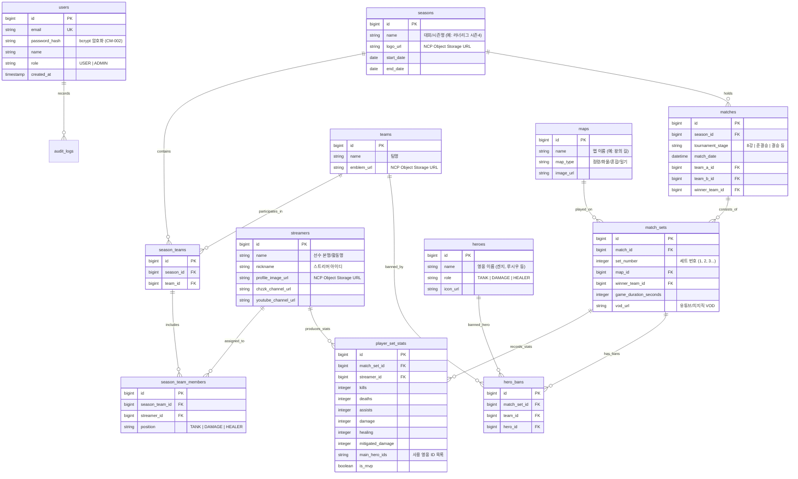

# ROMS (Runner's Overwatch Match System) DB 설계도 (NCP PostgreSQL & Prisma ERD)

> **문서 버전**: v1.2 (네이버 클라우드 플랫폼 NCP DB & Prisma 적용)  
> **작성일**: 2026-07-28  
> **기준 산출물**: ROMS 프로젝트 요구사항정의서 (`CM-001` ~ `AD-003`)

---

## 1. 네이버 클라우드 DB 개념적 / 논리적 ERD



---

## 2. 데이터 딕셔너리 (Data Dictionary - NCP PostgreSQL / MySQL)

### 2.1 `users` (사용자 & 관리자 테이블 - `CM-002`)
| 컬럼명 | 데이터 타입 | 제약 조건 | 설명 |
| :--- | :--- | :--- | :--- |
| `id` | BIGINT | PK, AUTO_INCREMENT / IDENTITY | 사용자 고유 식별자 |
| `email` | VARCHAR(255) | UNIQUE, NOT NULL | 로그인 이메일 |
| `password_hash` | VARCHAR(255) | NOT NULL | bcrypt 암호화된 비밀번호 (`CM-002`) |
| `name` | VARCHAR(100) | NULL | 사용자 이름 |
| `role` | VARCHAR(20) | NOT NULL, DEFAULT 'USER' | 권한 (`USER` / `ADMIN`) |
| `created_at` | TIMESTAMP | DEFAULT CURRENT_TIMESTAMP | 계정 생성 일시 |

---

### 2.2 `seasons` (대회 및 시즌 정보)
| 컬럼명 | 데이터 타입 | 제약 조건 | 설명 |
| :--- | :--- | :--- | :--- |
| `id` | BIGINT | PK, AUTO_INCREMENT / IDENTITY | 시즌 식별자 |
| `name` | VARCHAR(100) | NOT NULL | 시즌명 (예: 러너리그 시즌4, 라이벌클래시) |
| `logo_url` | TEXT | NULL | NCP Object Storage 로고 URL (`AD-001`) |
| `start_date` | DATE | NULL | 대회 시작일 |
| `end_date` | DATE | NULL | 대회 종료일 |

---

### 2.3 `teams` (팀 정보)
| 컬럼명 | 데이터 타입 | 제약 조건 | 설명 |
| :--- | :--- | :--- | :--- |
| `id` | BIGINT | PK, AUTO_INCREMENT / IDENTITY | 팀 고유 식별자 |
| `name` | VARCHAR(100) | NOT NULL | 팀명 (예: 학살팀, 러너팀) |
| `emblem_url` | TEXT | NULL | NCP Object Storage 팀 엠블럼 URL (`AD-001`) |

---

### 2.4 `streamers` (스트리머 / 선수 프로필)
| 컬럼명 | 데이터 타입 | 제약 조건 | 설명 |
| :--- | :--- | :--- | :--- |
| `id` | BIGINT | PK, AUTO_INCREMENT / IDENTITY | 스트리머 고유 식별자 |
| `name` | VARCHAR(100) | NOT NULL | 선수명 / 스트리머명 (`US-001`) |
| `nickname` | VARCHAR(100) | NULL | 방송 닉네임 |
| `profile_image_url` | TEXT | NULL | NCP Object Storage 프로필 이미지 URL |
| `chzzk_channel_url` | TEXT | NULL | 치지직 채널 링크 |
| `youtube_channel_url` | TEXT | NULL | 유튜브 채널 링크 |

---

### 2.5 `season_team_members` (시즌별 선수 소속 & 포지션)
| 컬럼명 | 데이터 타입 | 제약 조건 | 설명 |
| :--- | :--- | :--- | :--- |
| `id` | BIGINT | PK, AUTO_INCREMENT / IDENTITY | 배정 식별자 |
| `season_team_id` | BIGINT | FK (`season_teams.id`) | 시즌 참가 팀 FK |
| `streamer_id` | BIGINT | FK (`streamers.id`) | 스트리머 FK |
| `position` | VARCHAR(20) | NOT NULL | 포지션 (`TANK`, `DAMAGE`, `HEALER`) (`AD-002`) |

---

### 2.6 `matches` (경기 매치)
| 컬럼명 | 데이터 타입 | 제약 조건 | 설명 |
| :--- | :--- | :--- | :--- |
| `id` | BIGINT | PK, AUTO_INCREMENT / IDENTITY | 매치 식별자 |
| `season_id` | BIGINT | FK (`seasons.id`) | 소속 시즌 FK |
| `tournament_stage`| VARCHAR(50) | NOT NULL | 토너먼트 단계 (8강, 준결승, 결승 등) |
| `match_date` | TIMESTAMP | NULL | 경기 예정/시행 일시 |
| `team_a_id` | BIGINT | FK (`teams.id`) | A팀 FK |
| `team_b_id` | BIGINT | FK (`teams.id`) | B팀 FK |
| `winner_team_id` | BIGINT | FK (`teams.id`), NULL | 최종 승리팀 FK |

---

### 2.7 `match_sets` (세트별 경기 기록)
| 컬럼명 | 데이터 타입 | 제약 조건 | 설명 |
| :--- | :--- | :--- | :--- |
| `id` | BIGINT | PK, AUTO_INCREMENT / IDENTITY | 세트 기록 식별자 |
| `match_id` | BIGINT | FK (`matches.id`) | 매치 FK |
| `set_number` | INT | NOT NULL | 세트 번호 (1, 2, 3...) |
| `map_id` | BIGINT | FK (`maps.id`) | 맵 FK |
| `winner_team_id` | BIGINT | FK (`teams.id`) | 세트 승리팀 FK |
| `game_duration_sec`| INT | NULL | 경기 시간(초) |
| `vod_url` | TEXT | NULL | 다시보기 VOD URL (유튜브/치지직) (`US-002`, `US-012`) |

---

### 2.8 `player_set_stats` (선수 세트별 세부 스탯)
| 컬럼명 | 데이터 타입 | 제약 조건 | 설명 |
| :--- | :--- | :--- | :--- |
| `id` | BIGINT | PK, AUTO_INCREMENT / IDENTITY | 선수 스탯 식별자 |
| `match_set_id` | BIGINT | FK (`match_sets.id`) | 세트 FK |
| `streamer_id` | BIGINT | FK (`streamers.id`) | 스트리머 FK |
| `kills` | INT | DEFAULT 0 | 처치 수 (K) |
| `deaths` | INT | DEFAULT 0 | 죽음 수 (D) |
| `assists` | INT | DEFAULT 0 | 도움 수 (A) |
| `damage` | INT | DEFAULT 0 | 가한 피해량 |
| `healing` | INT | DEFAULT 0 | 치유량 |
| `mitigated_damage` | INT | DEFAULT 0 | 경감량 |
| `main_hero_ids` | TEXT | NULL | 해당 세트 사용 영웅 ID 목록 (Comma Separated) |
| `is_mvp` | BOOLEAN | DEFAULT FALSE | 세트 MVP 여부 (`AD-003`) |

---

## 3. Prisma Schema (`prisma/schema.prisma`) 명세

```prisma
datasource db {
  provider = "postgresql" // NCP Cloud DB for PostgreSQL (또는 "mysql")
  url      = env("DATABASE_URL")
}

generator client {
  provider = "prisma-client-js"
}

enum Role {
  USER
  ADMIN
}

enum Position {
  TANK
  DAMAGE
  HEALER
}

model User {
  id           BigInt   @id @default(autoincrement())
  email        String   @unique
  passwordHash String   @map("password_hash")
  name         String?
  role         Role     @default(USER)
  createdAt    DateTime @default(now()) @map("created_at")

  @@map("users")
}

model Season {
  id        BigInt   @id @default(autoincrement())
  name      String
  logoUrl   String?  @map("logo_url")
  startDate DateTime? @map("start_date") @db.Date
  endDate   DateTime? @map("end_date") @db.Date

  seasonTeams SeasonTeam[]
  matches     Match[]

  @@map("seasons")
}

model Team {
  id        BigInt   @id @default(autoincrement())
  name      String
  emblemUrl String?  @map("emblem_url")

  seasonTeams SeasonTeam[]
  heroBans    HeroBan[]

  @@map("teams")
}

model Streamer {
  id                BigInt   @id @default(autoincrement())
  name              String
  nickname          String?
  profileImageUrl   String?  @map("profile_image_url")
  chzzkChannelUrl   String?  @map("chzzk_channel_url")
  youtubeChannelUrl String?  @map("youtube_channel_url")

  teamMembers       SeasonTeamMember[]
  playerSetStats    PlayerSetStat[]

  @@map("streamers")
}

model SeasonTeam {
  id       BigInt @id @default(autoincrement())
  seasonId BigInt @map("season_id")
  teamId   BigInt @map("team_id")

  season Season @relation(fields: [seasonId], references: [id], onDelete: Cascade)
  team   Team   @relation(fields: [teamId], references: [id], onDelete: Cascade)

  members SeasonTeamMember[]

  @@map("season_teams")
}

model SeasonTeamMember {
  id           BigInt   @id @default(autoincrement())
  seasonTeamId BigInt   @map("season_team_id")
  streamerId   BigInt   @map("streamer_id")
  position     Position

  seasonTeam SeasonTeam @relation(fields: [seasonTeamId], references: [id], onDelete: Cascade)
  streamer   Streamer   @relation(fields: [streamerId], references: [id], onDelete: Cascade)

  @@map("season_team_members")
}

model Match {
  id              BigInt   @id @default(autoincrement())
  seasonId        BigInt   @map("season_id")
  tournamentStage String   @map("tournament_stage")
  matchDate       DateTime? @map("match_date")
  teamAId         BigInt   @map("team_a_id")
  teamBId         BigInt   @map("team_b_id")
  winnerTeamId    BigInt?  @map("winner_team_id")

  season Season     @relation(fields: [seasonId], references: [id], onDelete: Cascade)
  sets   MatchSet[]

  @@map("matches")
}

model MapItem {
  id       BigInt @id @default(autoincrement())
  name     String
  mapType  String @map("map_type")
  imageUrl String? @map("image_url")

  matchSets MatchSet[]

  @@map("maps")
}

model MatchSet {
  id                  BigInt   @id @default(autoincrement())
  matchId             BigInt   @map("match_id")
  setNumber           Int      @map("set_number")
  mapId               BigInt   @map("map_id")
  winnerTeamId        BigInt   @map("winner_team_id")
  gameDurationSeconds Int?     @map("game_duration_seconds")
  vodUrl              String?  @map("vod_url")

  match Match   @relation(fields: [matchId], references: [id], onDelete: Cascade)
  map   MapItem @relation(fields: [mapId], references: [id], onDelete: Cascade)

  playerStats PlayerSetStat[]
  heroBans    HeroBan[]

  @@map("match_sets")
}

model PlayerSetStat {
  id              BigInt   @id @default(autoincrement())
  matchSetId      BigInt   @map("match_set_id")
  streamerId      BigInt   @map("streamer_id")
  kills           Int      @default(0)
  deaths          Int      @default(0)
  assists         Int      @default(0)
  damage          Int      @default(0)
  healing         Int      @default(0)
  mitigatedDamage Int      @default(0) @map("mitigated_damage")
  mainHeroIds     String?  @map("main_hero_ids")
  isMvp           Boolean  @default(false) @map("is_mvp")

  matchSet MatchSet @relation(fields: [matchSetId], references: [id], onDelete: Cascade)
  streamer Streamer @relation(fields: [streamerId], references: [id], onDelete: Cascade)

  @@map("player_set_stats")
}

model HeroBan {
  id         BigInt @id @default(autoincrement())
  matchSetId BigInt @map("match_set_id")
  teamId     BigInt @map("team_id")
  heroId     BigInt @map("hero_id")

  matchSet MatchSet @relation(fields: [matchSetId], references: [id], onDelete: Cascade)
  team     Team     @relation(fields: [teamId], references: [id], onDelete: Cascade)

  @@map("hero_bans")
}
```
