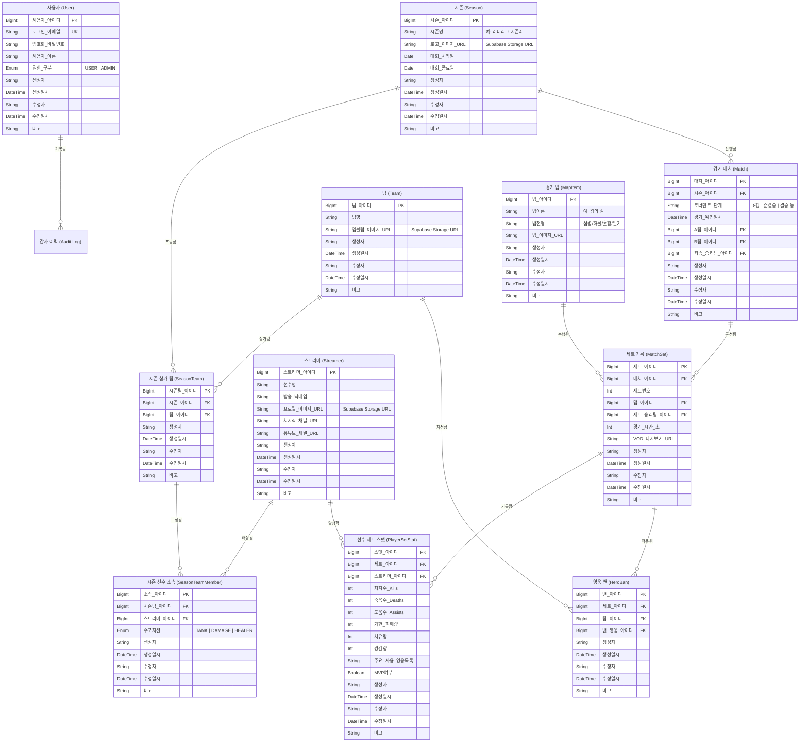
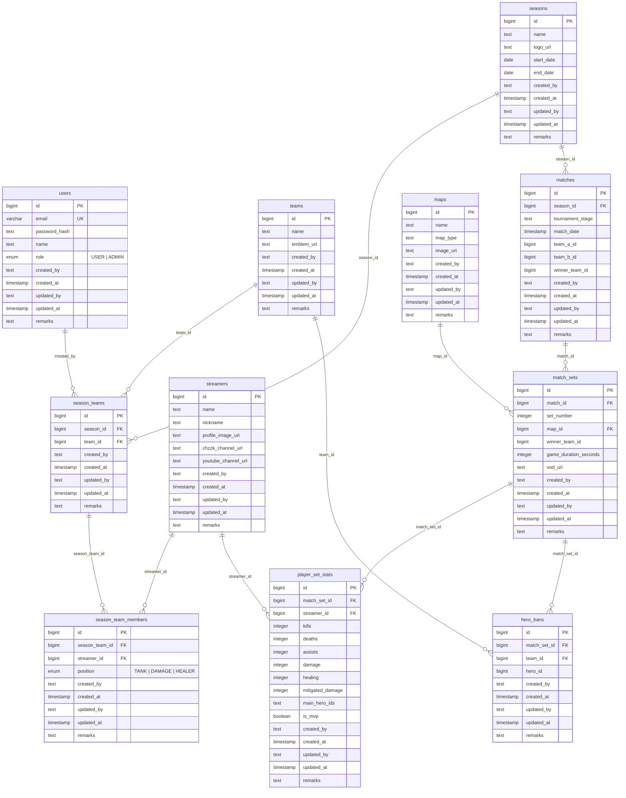

# ROMS (Runner's Overwatch Match System) 논리 / 물리 ERD 설계서

> **문서 버전**: v1.4 (Supabase PostgreSQL & RLS / 공통 감사 컬럼 반영)  
> **작성일**: 2026-07-30  
> **프로젝트명**: ROMS (오버워치 e스포츠 아카이브 및 대시보드 시스템)  
> **기준 환경**: Supabase Cloud DB (PostgreSQL 15+), Prisma ORM v5.22, Row Level Security (RLS)  

---

## 1. 논리적 ERD (Logical ERD)

개념 및 비즈니스 관점에서 e스포츠 도메인 엔터티(사용자, 시즌, 팀, 스트리머, 매치, 세트, 스탯 등)와 엔터티 간의 관계를 표현한 논리적 모델입니다.

---

## 2. 물리적 ERD (Physical ERD)

PostgreSQL 및 Supabase Cloud DB 상에 실제 DDL로 생성된 물리 데이터베이스 스키마 및 외래키(FK) 구조입니다.

---

## 3. 엔터티 연관 관계 명세서 (Entity Relationships)

| 부모 테이블 (Parent) | 자식 테이블 (Child) | 관계 (Cardinality) | 외래키 컬럼 (FK) | 삭제 제약 조건 (On Delete) |
| :--- | :--- | :---: | :--- | :--- |
| `seasons` | `season_teams` | `1 : N` | `season_teams.season_id` | `CASCADE` |
| `teams` | `season_teams` | `1 : N` | `season_teams.team_id` | `CASCADE` |
| `season_teams` | `season_team_members` | `1 : N` | `season_team_members.season_team_id` | `CASCADE` |
| `streamers` | `season_team_members` | `1 : N` | `season_team_members.streamer_id` | `CASCADE` |
| `seasons` | `matches` | `1 : N` | `matches.season_id` | `CASCADE` |
| `matches` | `match_sets` | `1 : N` | `match_sets.match_id` | `CASCADE` |
| `maps` | `match_sets` | `1 : N` | `match_sets.map_id` | `CASCADE` |
| `match_sets` | `player_set_stats` | `1 : N` | `player_set_stats.match_set_id` | `CASCADE` |
| `streamers` | `player_set_stats` | `1 : N` | `player_set_stats.streamer_id` | `CASCADE` |
| `match_sets` | `hero_bans` | `1 : N` | `hero_bans.match_set_id` | `CASCADE` |
| `teams` | `hero_bans` | `1 : N` | `hero_bans.team_id` | `CASCADE` |
