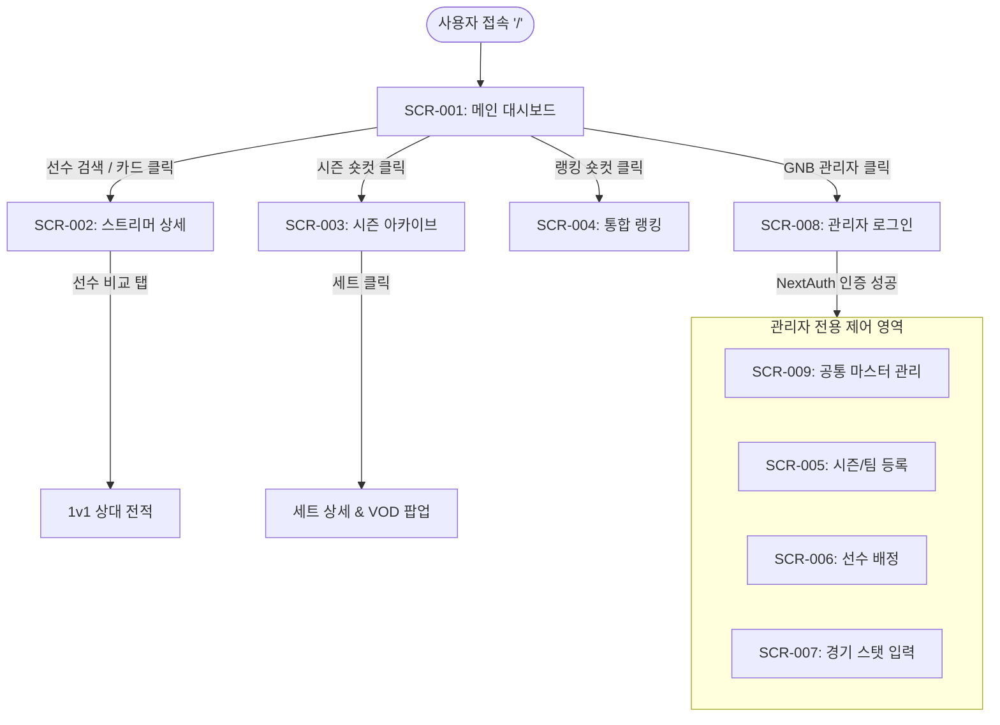

# ROMS (Runner's Overwatch Match System) 메뉴구성도 (IA & Screen List)

> **문서 버전**: v1.2  
> **작성일**: 2026-07-30  
> **프로젝트명**: ROMS (오버워치 e스포츠 아카이브 및 대시보드 시스템)  
> **기준 산출물**: ROMS 요구사항정의서 v1.6 (`CM-001` ~ `AD-004`)  

---

## 1. 메뉴 구성도 (Information Architecture - IA)

```
ROMS System (메인 루트 '/')
│
├── [1.0 User Portal (사용자 영역)] - 누구나 접근 가능 (Public)
│   │
│   ├── 1.1 메인 대시보드 (SCR-001)
│   │   ├── 1.1.1 상단 네비게이션 & 통합 검색바 (GNB 탭: 러너리그, 라이벌클래시, 랭킹) (US-001)
│   │   ├── 1.1.2 시즌 챔피언 히어로 포스터 (Season Champion & 전적 상세보기 CTA) (CM-001)
│   │   ├── 1.1.3 러너리그 순위 리스트 (Top 5 선수 Ranking, WINS, KDA, 승률) (CM-001)
│   │   ├── 1.1.4 이번 시즌 지표 (최다처치/도움/죽음/피해/치유/경감 6대 Stat Strip) (CM-001)
│   │   └── 1.1.5 최근 경기 결과 리스트 (대회 태그, 대진, 스코어, 승패 뱃지) (CM-001)
│   │
│   ├── 1.2 스트리머 상세 (SCR-002)
│   │   ├── 1.2.1 프로필 헤더 (선수명, 닉네임, 대표 포지션 뱃지)
│   │   ├── 1.2.2 개요 탭 (모스트 영웅, 승률, 하이라이트 영상, 스탯 평균/최대) (US-003)
│   │   ├── 1.2.3 업적 탭 (참여 대회 순위, 대회명, 토너먼트 단계, 상금) (US-004)
│   │   ├── 1.2.4 경기 맵별 결과 탭 (경기 일자, 맵, 승패, 진영, 영웅 밴, KDA) (US-005)
│   │   ├── 1.2.5 맵별 데이터 탭 (맵별 총 경기수, 승패, 승률) (US-011)
│   │   └── 1.2.6 1v1 선수 비교 탭 (상대 전적 및 레이더 차트) (US-006)
│   │
│   ├── 1.3 시즌 아카이브 (SCR-003)
│   │   ├── 1.3.1 시즌 헤더 (시즌명, 대회 기간, 시즌 로고)
│   │   ├── 1.3.2 대진표 탭 (토너먼트 8강/준결승/결승 트리) (US-008)
│   │   ├── 1.3.3 일정 & 결과 탭 (일자별 경기 및 세트 스코어) (US-009)
│   │   ├── 1.3.4 참가 팀 & 맵풀 탭 (팀 엠블럼, 로스터, 사용 맵) (US-010)
│   │   ├── 1.3.5 세트 상세 팝업 (세트별 승리팀, 선수 KDA/피해/치유, MVP, VOD 링크) (US-012, US-013)
│   │   └── 1.3.6 시즌 통계 탭 (영웅 픽률, 맵 픽률 차트) (US-011)
│   │
│   └── 1.4 통합 랭킹 (SCR-004)
│       ├── 1.4.1 선수 랭킹 (우승 횟수, KDA, 총 피해/치유/경감량) (US-007)
│       ├── 1.4.2 영웅 랭킹 (픽률, 모스트 Pick Top3) (US-011)
│       └── 1.4.3 맵 랭킹 (최다 플레이 맵) (US-011)
│
└── [2.0 Admin Portal (관리자 영역)] - ADMIN 권한 전용 (Protected)
    │
    ├── 2.1 관리자 로그인 (SCR-008) - NextAuth.js 기반 Credentials 인증 (CM-002)
    │
    ├── 2.2 공통관리 (마스터 데이터 관리) (SCR-009)
    │   ├── 2.2.1 스트리머(선수) 등록 (선수명, 방송 닉네임, 프로필 이미지 URL, 채널 URL) (AD-004)
    │   ├── 2.2.2 영웅 등록 및 관리 (영웅명, 역할군 TANK/DAMAGE/HEALER, 영웅 아이콘) (AD-004)
    │   └── 2.2.3 맵 등록 및 관리 (맵 이름, 맵 전형 점령/화물/혼합/밀기, 맵 이미지) (AD-004)
    │
    ├── 2.3 대회/시즌 및 팀 관리 (SCR-005)
    │   ├── 2.3.1 시즌 등록 (대회명, 기간, Supabase Storage 로고 업로드) (AD-001)
    │   └── 2.3.2 팀 생성 (팀명, Supabase Storage 엠블럼 업로드) (AD-001)
    │
    ├── 2.4 선수 배정 및 포지션 관리 (SCR-006)
    │   └── 2.4.1 스트리머 배정 (시즌 참가 팀 지정, 포지션 TANK/DAMAGE/HEALER 설정) (AD-002)
    │
    └── 2.5 경기 결과 & 세부 스탯 입력 (SCR-007)
        ├── 2.5.1 매치 생성 (대회 단계, 경기 일시, 팀A vs 팀B) (AD-003)
        ├── 2.5.2 세트 입력 (세트 번호, 맵 선택, 세트 승리팀, 경기 시간, VOD URL) (AD-003)
        ├── 2.5.3 영웅 밴 지정 (팀별 밴 영웅 선택) (AD-003)
        └── 2.5.4 선수별 세부 스탯 입력 (K/D/A, 피해/치유/경감량, MVP 토글) (AD-003)
```

---

## 2. 화면 목록 (Screen List)

| 화면 ID | 화면명 | URL 경로 (`App Router`) | 접근 권한 | 주요 기능 및 요약 | 연동 요구사항 ID |
| :--- | :--- | :--- | :---: | :--- | :--- |
| `SCR-001` | **메인 대시보드** | `/` | 전체 (Public) | 상단 GNB 탭 및 검색바, 히어로 챔피언 포스터, 러너리그 순위 리스트, 이번 시즌 6대 지표, 최근 경기 결과 | `CM-001`, `US-001` |
| `SCR-002` | **스트리머 상세** | `/streamer/[id]` | 전체 (Public) | 스트리머 프로필, 5개 탭(개요/업적/결과/맵/1v1비교), 통계 차트 및 경기 기록 표출 | `US-001` ~ `US-006` |
| `SCR-003` | **시즌 아카이브** | `/season/[id]` | 전체 (Public) | 시즌 대진표 트리, 경기 일정/결과, 참가 팀 로스터, 세트 스탯 모달, VOD 링크 | `US-002`, `US-008` ~ `US-013` |
| `SCR-004` | **통합 랭킹** | `/ranking` | 전체 (Public) | 전체 시즌 기준 선수/영웅/맵 순위 리더보드 및 필터링 조회 | `US-007`, `US-011` |
| `SCR-005` | **관리자 - 시즌 & 팀 관리** | `/admin/season` | 관리자 (ADMIN) | 대회/시즌 생성, 로고/엠블럼 이미지 업로드 (Supabase Storage 연동) | `AD-001` |
| `SCR-006` | **관리자 - 선수 배정** | `/admin/roster` | 관리자 (ADMIN) | 스트리머를 특정 시즌 팀에 배정 및 포지션(탱/딜/힐) 설정 | `AD-002` |
| `SCR-007` | **관리자 - 경기 스탯 입력**| `/admin/match` | 관리자 (ADMIN) | 매치/세트 결과 생성, 맵 및 영웅 밴 선택, 선수별 K/D/A, 피해/치유량 및 MVP 설정 | `AD-003` |
| `SCR-008` | **관리자 로그인** | `/auth/login` | 전체 (Public) | NextAuth.js 기반 이메일/비밀번호 인증 로그인 처리 | `CM-002` |
| `SCR-009` | **관리자 - 공통관리** | `/admin/common` | 관리자 (ADMIN) | 스트리머(선수) 등록/수정, 영웅 및 맵 마스터 데이터 등록 관리 | `AD-004` |

---

## 3. 화면 이동 및 네비게이션 흐름도 (User Navigation Flow)



---

## 4. 권한별 화면 접근 제어 매트릭스 (Role-Based Access Control)

| 화면 ID | 화면명 | 일반 시청자 (`GUEST`) | 로그인 사용자 (`USER`) | 관리자 (`ADMIN`) |
| :--- | :--- | :---: | :---: | :---: |
| `SCR-001` | 메인 대시보드 | O | O | O |
| `SCR-002` | 스트리머 상세 | O | O | O |
| `SCR-003` | 시즌 아카이브 | O | O | O |
| `SCR-004` | 통합 랭킹 | O | O | O |
| `SCR-008` | 관리자 로그인 | O | O | O |
| `SCR-009` | 관리자 - 공통관리 | X | X | **O** |
| `SCR-005` | 관리자 - 시즌 & 팀 관리 | X | X | **O** |
| `SCR-006` | 관리자 - 선수 배정 | X | X | **O** |
| `SCR-007` | 관리자 - 경기 스탯 입력 | X | X | **O** |
