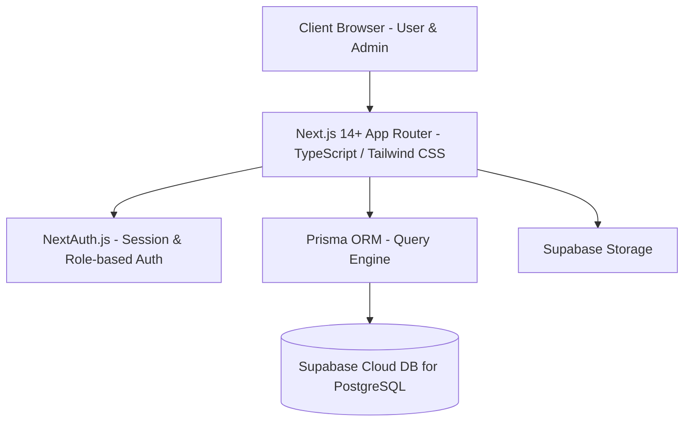
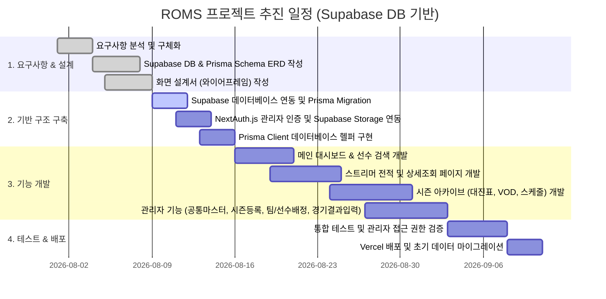

# ROMS (Runner's Overwatch Match System) 프로젝트 계획서

> **문서 버전**: v1.6 (관리자 메뉴 구조 변경: 스트리머(선수) 등록을 공통관리에서 대회/시즌, 팀 및 선수 관리 메뉴로 이동)  
> **작성일**: 2026-07-29  
> **기준 산출물**: ROMS 프로젝트 요구사항정의서 v1.7  

---

## 1. 프로젝트 개요 및 목적

### 1.1 프로젝트 개요
**ROMS (Runner's Overwatch Match System)**는 오버워치 e스포츠 대회(러너리그 시즌 1~4 및 라이벌 클래시 등)의 경기 기록, 대진표, 선수(스트리머) 전적, 맵/영웅 통계 데이터를 체계적으로 수집·관리가 가능하도록 구축하는 **통합 e스포츠 아카이브 및 대시보드 시스템**입니다.

### 1.2 개발 목적
1. **시청자/팬 경험 향상**: 선수별 통합 전적, 시즌별 대진표, 세트별 VOD 하이라이트 및 선수 상세 스탯(KDA, 피해량, 치유량, 경감량 등)을 직관적인 대시보드로 제공.
2. **운영 효율화**: 관리자(ADMIN) 전용 페이지를 통해 공통 마스터(영웅/맵) 등록, 대회 생성, 팀 및 선수 등록/배정, 경기 세트 점수 및 선수별 상세 스탯 입력을 신속하고 정확하게 처리.
3. **클라우드 인프라(Supabase) 연동**: **Supabase** 데이터베이스(PostgreSQL) 및 Storage 인프라를 활용하여 높은 확장성과 안정적인 글로벌/국내 네트워크 속도 확보.

---

## 2. 추진 범위 및 주요 기능 (Scope of Work)

### 2.1 사용자 서비스 (User Portal)
* **메인 대시보드 (`CM-001`)**:
  * 상단 GNB 네비게이션 탭(`러너리그`, `라이벌클래시`, `랭킹`) 및 통합 검색바
  * 시즌 챔피언 히어로 포스터 (우승자 전적/스탯 하이라이트 및 전적 상세보기 CTA)
  * 러너리그 Top 5 순위 리스트 (순위, 포지션 뱃지, WINS, KDA, 승률)
  * 이번 시즌 6대 주요 지표 스트립 (최다처치, 최다도움, 최다죽음, 최다피해, 최다치유, 최다경감)
  * 최근 경기 결과 리스트 (대회 태그, 대진명, 세트 스코어, 승패 뱃지)
* **스트리머(선수) 정보 조회 (`US-001`, `US-003` ~ `US-006`)**:
  * 스트리머 검색 및 시즌별 소속 팀/전적 조회
  * **개요 탭**: 하이라이트 영상, 모스트 영웅 Top3, 최고 승률 맵, 경기당 평균/최대 스탯
  * **업적 탭**: 참여 대회 결과(순위, 대회명, 토너먼트 단계, 상금 등)
  * **경기 맵별 결과 탭**: 경기 날짜, 맵, 승패, 진영, 영웅 밴 목록, KDA, 스탯
  * **맵별 데이터 탭**: 맵별 총 경기수, 승패, 승률
  * **선수 비교 (1v1)**: 2명의 스트리머 상대 전적 비교 기능
* **시즌 아카이브 (`US-002`, `US-008` ~ `US-013`)**:
  * 시즌별 대진표 (트리/표 구조), 일정 스케줄, 참가 팀 및 맵풀 정보
  * 경기 결과 상세 (세트 스코어, 맵별 승리팀, 유튜브/치지직 VOD 링크, 선수별 세부 스탯)
  * 시즌 통계 (맵별 픽률, 선수별 영웅 픽률, 영웅별 픽률)
* **통합 랭킹 (`US-007`)**:
  * 선수/영웅/맵 기준 순위 조회 (우승 횟수, Most Pick Top3 등)

### 2.2 관리자 서비스 (Admin Portal)
* **권한별 로그인 (`CM-002`)**:
  * **NextAuth.js (Auth.js)** + bcrypt 비밀번호 암호화 기반 사용자(USER) 및 운영자(ADMIN) 세션 관리 및 페이지 접근 제어
* **공통 마스터 등록 및 관리 (`AD-004`)**:
  * 오버워치 영웅 마스터 및 맵 마스터 데이터 등록/수정
* **대회/시즌, 선수 및 팀 등록 (`AD-001`, `AD-004`)**:
  * 시즌(대회명, 기간, 로고) 등록, 스트리머(선수) 프로필 및 채널 URL 등록/수정, 참가 팀 생성 및 엠블럼 업로드 (**Supabase Storage** 연동)
* **선수 배정 관리 (`AD-002`)**:
  * 등록된 스트리머를 특정 시즌 팀에 배정 및 포지션(탱/딜/힐) 설정
* **경기 결과 관리 (`AD-003`)**:
  * 세트별 스코어, 승리팀, 사용 영웅, MVP, 세부 스탯(K/D/A, 피해/치유/경감량) 입력 및 대시보드 자동 합산 반영

---

## 3. 기술 스택 및 서비스 아키텍처

* **Frontend**: Next.js 14+ (App Router), TypeScript, Tailwind CSS, Lucide Icons, Recharts (통계 차트)
* **Backend**: Next.js Server Actions & API Routes
* **Database & ORM**: **Supabase Cloud DB** (PostgreSQL) + **Prisma ORM**
* **Authentication**: **NextAuth.js** (Credentials Provider / bcrypt 암호화 / Role: `USER`, `ADMIN`)
* **Storage**: **Supabase Storage**
* **Deployment**: Vercel 배포

---

## 4. 추진 일정 (WBS 및 Mermaid Gantt)

---

## 5. Supabase 백엔드 인프라 구성

| 구성 요소 | 기술 스택 | 설명 및 활용 |
| :--- | :--- | :--- |
| **Database** | Supabase Cloud (PostgreSQL) | Prisma ORM과 연동되어 e스포츠 경기, 선수, 팀 통계 데이터 저장 |
| **Connection** | Connection Pooler (Prisma) | Transaction/Session Pooler를 통한 안정적인 서버리스 DB 연결 |
| **Storage** | Supabase Storage | 팀 엠블럼, 선수 프로필 이미지 등 미디어 파일 저장 |
